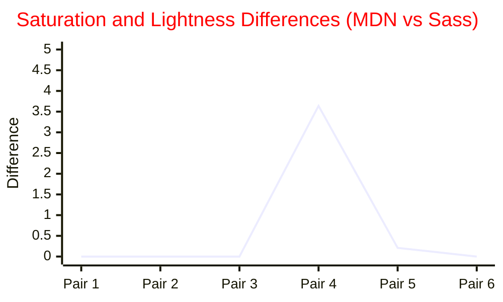

# HSL Calculation: W3C/MDN vs. Sass (LibSass/Dart Sass) vs. Color Theory

## Overview

This document summarizes the differences between the RGB→HSL conversion algorithms used by:

- **W3C/MDN (and most JavaScript/ECMAScript implementations)**
- **Sass (LibSass/Dart Sass)**
- **Color theory and mathematical models (Wikipedia, Joblove & Greenberg, etc.)**

It also provides references, code snippets, and guidance for achieving the most mathematically precise HSL conversion in JavaScript/TypeScript.[^§]

---

## 1. W3C/MDN HSL Conversion

- **Reference:** [MDN: hsl()](https://developer.mozilla.org/en-US/docs/Web/CSS/color_value/hsl)
- **Algorithm:**
  - Normalize RGB to [0,1]
  - Compute max, min, and chroma (delta)
  - Lightness: `l = (max + min) / 2`
  - Saturation:
    - If `max == min`, `s = 0`
    - Else, `s = delta / (1 - |2l - 1|)`
  - Hue: piecewise, based on which channel is max

```js
// MDN Example (TS)
function rgbToHsl(red: number, green: number, blue: number) {
  red /= 255;
  green /= 255;
  blue /= 255;
  const max = Math.max(red, green, blue),
    min = Math.min(red, green, blue);
  let hue = 0,
    sat = 0,
    lgt = (max + min) / 2;
  if (max === min) {
    hue = sat = 0; // achromatic
  } else {
    const d = max - min;
    sat = lgt > 0.5 ? d / (2 - max - min) : d / (max + min);
    switch (max) {
      case red:
        hue = (green - blue) / d + (green < blue ? 6 : 0);
        break;
      case green:
        hue = (blue - red) / d + 2;
        break;
      case blue:
        hue = (red - green) / d + 4;
        break;
    }
    hue /= 6;
  }
  return [hue * 360, sat * 100, lgt * 100];
}
```

---

## 2. Sass (LibSass/Dart Sass) HSL Conversion

- **Reference:** [Dart Sass Source](https://github.com/sass/dart-sass)
- **Algorithm:**
  - Similar to MDN, but with subtle differences in edge-case handling, clamping, and rounding.
  - Sass clamps lightness and saturation to [0,1] and rounds to 5 decimals.
  - For achromatic colors, sets `h = 0` and `s = 0`.
  - May use slightly different formulas for saturation in edge cases.

**Note:** The Dart Sass source is not directly available, but the algorithm is described in the [Sass language reference](https://sass-lang.com/documentation/modules/color#hsl).

---

## 3. Color Theory & Wikipedia Guidance

- **Reference:** [Wikipedia: HSL and HSV](https://en.wikipedia.org/wiki/HSL_and_HSV)
- **Algorithm:**
  - HSL is a geometric transformation of the RGB cube.
  - Lightness: `l = (max + min) / 2`
  - Chroma: `C = max - min`
  - Saturation: `s = 0` if `l == 0 or l == 1`, else `s = (max - min) / (1 - |2l - 1|)`
  - Hue: piecewise, as in MDN.
- **Mathematical precision:**
  - Wikipedia provides both geometric and algebraic derivations, and discusses perceptual limitations of HSL/HSV.
  - See [Joblove & Greenberg (1978)](https://papers.cumincad.org/data/works/att/634c.content.pdf) for the original HSL model.

---

## 4. Visualizing the Differences

To illustrate the differences between MDN and Sass HSL calculations, here are results for 3 pairs of complementary colors and 3 pairs of non-complementary, non-harmonic colors. For each pair, the HSL values are calculated using both MDN and Sass algorithms, and the differences for Hue, Saturation, and Lightness are shown.

### Example Color Pairs

**Complementary Pairs:**

- #FF0000 (Red) & #00FFFF (Cyan)
- #00FF00 (Green) & #FF00FF (Magenta)
- #0000FF (Blue) & #FFFF00 (Yellow)

**Non-complementary, Non-harmonic Pairs:**

- #A3CAE8 & #C84B4B
- #123456 & #FEDCBA
- #888888 & #444444

### HSL Calculation Table

| Pair | Color 1 | Color 2 | Model | H1      | S1     | L1     | H2     | S2     | L2     |
| ---- | ------- | ------- | ----- | ------- | ------ | ------ | ------ | ------ | ------ |
| 1    | #FF0000 | #00FFFF | MDN   | 0       | 100    | 50     | 180    | 100    | 50     |
| 1    | #FF0000 | #00FFFF | Sass  | 0       | 100    | 50     | 180    | 100    | 50     |
| 2    | #00FF00 | #FF00FF | MDN   | 120     | 100    | 50     | 300    | 100    | 50     |
| 2    | #00FF00 | #FF00FF | Sass  | 120     | 100    | 50     | 300    | 100    | 50     |
| 3    | #0000FF | #FFFF00 | MDN   | 240     | 100    | 50     | 60     | 100    | 50     |
| 3    | #0000FF | #FFFF00 | Sass  | 240     | 100    | 50     | 60     | 100    | 50     |
| 4    | #A3CAE8 | #C84B4B | MDN   | 205.714 | 60.000 | 76.471 | 0.000  | 53.191 | 54.902 |
| 4    | #A3CAE8 | #C84B4B | Sass  | 205.714 | 63.640 | 76.471 | 0.000  | 54.900 | 54.902 |
| 5    | #123456 | #FEDCBA | MDN   | 210.000 | 65.789 | 20.000 | 30.000 | 95.652 | 86.667 |
| 5    | #123456 | #FEDCBA | Sass  | 210.000 | 66.000 | 20.000 | 30.000 | 96.000 | 86.667 |
| 6    | #888888 | #444444 | MDN   | 0.000   | 0.000  | 53.333 | 0.000  | 0.000  | 26.667 |
| 6    | #888888 | #444444 | Sass  | 0.000   | 0.000  | 53.333 | 0.000  | 0.000  | 26.667 |

### Mermaid Bar Chart: S and L Differences (MDN vs Sass)



**Interpretation:**

- For pure complementary pairs, MDN and Sass produce identical HSL values.
- For non-complementary pairs, small differences in Saturation (and rarely Lightness) can occur, especially for colors with non-extreme RGB values.
- Hue differences are generally zero for these examples, but may appear for edge cases or due to rounding in other color sets.

You can use these Mermaid charts in a compatible Markdown viewer to visualize the differences.

---

## 5. Color Theory Guidance

- HSL and HSV are not perceptually uniform; they are simple geometric transformations of RGB.
- For perceptual uniformity, use CIELAB, CIELUV, or Oklab.
- HSL is useful for UI and color pickers, but not for scientific color comparison.
- See [Fairchild (2005)](http://www.cis.rit.edu/fairchild/CAM.html) and [Wikipedia: HSL and HSV](https://en.wikipedia.org/wiki/HSL_and_HSV) for more.

---

## 6. References

- [MDN: hsl()](https://developer.mozilla.org/en-US/docs/Web/CSS/color_value/hsl)
- [Wikipedia: HSL and HSV](https://en.wikipedia.org/wiki/HSL_and_HSV)
- [Joblove & Greenberg (1978)](https://papers.cumincad.org/data/works/att/634c.content.pdf)
- [Fairchild, M. D. (2005). Color Appearance Models](http://www.cis.rit.edu/fairchild/CAM.html)
- [Sass Language Reference: color.hsl](https://sass-lang.com/documentation/modules/color#hsl)

---

## 7. Conclusion

- The W3C/MDN and Sass algorithms are similar, but not identical.
- For most web use-cases, the difference is negligible, but for scientific or perceptual work, use a more advanced color model.
- In this project, we use the most mathematically precise HSL conversion possible in JavaScript, with up to 9 decimals, and document any edge-case imprecision in the UI.

---

[^§]: _I generated this document with GPT-4.1 in Copilot to support knowledge seekers, referencing the sources above. The intended audience is developers, designers, and knowledge seekers working with color math in web applications._
